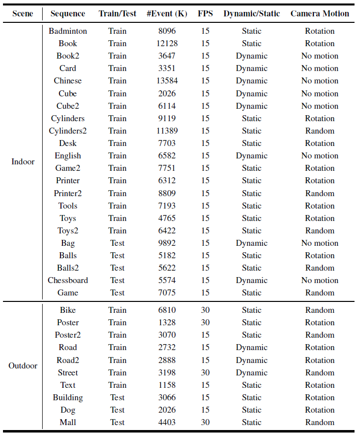

# GEM - Generalizing Event-Based Motion Deblurring in Real-World Scenarios 
## [Paper](https://arxiv.org/pdf/2308.05932.pdf) | [Supp](https://1drv.ms/b/s!AgjOZB4WHoLekHe6HooEZJhEb0oN?e=YHhgp2)

Event-based motion deblurring has shown promising results by exploiting low-latency events. However, current approaches are limited in their practical usage, as they assume the same spatial resolution of inputs and specific blurriness distributions. This work addresses these limitations and aims to generalize the performance of event-based deblurring in real-world scenarios. We propose a scale-aware network that allows flexible input spatial scales and enables learning from different temporal scales of motion blur. A two-stage self-supervised learning scheme is then developed to fit real-world data distribution. By utilizing the relativity of blurriness, our approach efficiently ensures the restored brightness and structure of latent images and further generalizes deblurring performance to handle varying spatial and temporal scales of motion blur in a self-distillation manner. Our method is extensively evaluated, demonstrating remarkable performance, and we also introduce a real-world dataset consisting of multi-scale blurry frames and events to facilitate research in event-based deblurring.
<div align=center>  </div>

## Environment setup

- Python 3.7
- NVIDIA GPU + CUDA
- Pytorch-Lightning 1.6.0
- numpy, argparse, yaml, opencv-python

You can create a new [Anaconda](https://www.anaconda.com/products/individual) environment as follows.
<br>
```
conda create -n gem python=3.7
conda activate gem
```
Clone this repository.
```
git clone git@github.com:XiangZ-0/GEM.git
```
Install the above dependencies and [Deformable Convolution V2](https://github.com/chengdazhi/Deformable-Convolution-V2-PyTorch/tree/pytorch_1.0.0)
```
cd GEM
pip install -r requirements.txt
cd codes/model/DCN_v2/
sh make.sh
```

## Download model and data
[Pretrained models](https://1drv.ms/f/s!AgjOZB4WHoLei2Kz5horpPI6A1aP?e=dNZypa) and [datasets](https://1drv.ms/f/s!AgjOZB4WHoLei2PMmIQza0cPaWZA?e=acFSD4) can be downloaded via One Drive.
<br>
In our paper, we conduct experiments on three types of data:
- [**Ev-REDS**](https://1drv.ms/u/s!AgjOZB4WHoLei2muGp13XErEWUje?e=UEX6PC) contains synthetic 1280x640 blurry images and synthetic 320x160 events. We first convert [REDS](https://seungjunnah.github.io/Datasets/reds.html) into high frame rate videos using [RIFE](https://github.com/hzwer/arXiv2021-RIFE), and then obtain blurry images by averaging sharp frames and generate events from down-sampled images via [VID2E](https://github.com/uzh-rpg/rpg_vid2e).
- [**HS-ERGB**](https://1drv.ms/u/s!AgjOZB4WHoLei2i5592hGjKTr4f5?e=StI9NY) contains synthetic blurry images and real-world events from [HS-ERGB](https://github.com/uzh-rpg/rpg_timelens). We first convert HS-ERGB into high frame rate videos using [Time Lens](https://github.com/uzh-rpg/rpg_timelens) and then synthesize blurry images by averaging sharp frames. Since only the test set of HS-ERGB is available, we choose 4 sequences (*far-bridge_lake_01*, *close-fountain_schaffhauserplatz_02*, *close-spinning_umbrella*, and *close-water_bomb_floor_01*) for testing and leave the rest for training. We mannually filter the static frames in the HS-ERGB dataset (where no motion blur occurs) to ensure valid evaluation of deblurring performance.
- [**MS-RBD**](https://1drv.ms/u/s!AgjOZB4WHoLei2dP0HuRdpyCXT3S?e=UzC9bk) contains real-world blurry images and real-world events collected by ourselves. A beam splitter connecting a FLIR BlackFly S RGB camera and a DAVIS346 event camera is built for data collection. In total, our MS-RBD contains 32 sequences composed of 22 indoor and 10 outdoor scenes, where each sequence consists of 60 RGB 1152x768 blurry frames and the concurrent 288x192 events. For self-supervised methods, we select 5 and 3 sequences from the indoor and outdoor scenes for testing and leave the rest for training. For supervised approaches, all sequences can be used for qualitative evaluation of deblurring performance in real-world scenarios.

<div align=center>  </div>
<div align=center> MS-RBD capture system </div>

<div align=center>  </div>
<div align=center> Overview of MS-RBD </div>

<div align=center>  </div>
<div align=center>  </div>
<div align=center> Examples of MS-RBD </div>

## Easy start
### Initialization
- Change the parent directory to `./codes/`
```
cd codes
```
- Download and unzip [pretrained models](https://1drv.ms/f/s!AgjOZB4WHoLei2Kz5horpPI6A1aP?e=dNZypa) to directory `./checkpoint/`
- Download and unzip [datasets](https://1drv.ms/f/s!AgjOZB4WHoLei2PMmIQza0cPaWZA?e=acFSD4) to directory `./datasets/`

### Test
- Test on Ev-REDS data
```
python main.py --yaml_path configs/evreds_test.yaml
```
- Test on HS-ERGB data
```
python main.py --yaml_path configs/hsergb_test.yaml
```
- Test on MS-RBD data
```
python main.py --yaml_path configs/msrbd_test.yaml
```
Deblurred results will be saved in `./results/`. Note that the script will automatically compute PSNR and SSIM for Ev-REDS and HS-ERGB datasets. Since MS-RBD is a real-world dataset without ground-truth images, we predict the central sharp latent image for qualitative evaluation in real-world scenarios. 

### Train
- Train on Ev-REDS data
```
python main.py --yaml_path configs/evreds_train.yaml
```
- Train on HS-ERGB data
```
python main.py --yaml_path configs/hsergb_train.yaml
```
- Train on MS-RBD data
```
python main.py --yaml_path configs/msrbd_train.yaml
```
If you want to train a model on your own dataset (especially real-world datasets), it is recommended to pack your data in the MS-RBD format and then modify `configs/msrbd_train.yaml` according to your needs for training :)

## Citation
If you find our work useful in your research, please consider citing:

```
@inproceedings{zhang2023generalizing,
  title={Generalizing Event-Based Motion Deblurring in Real-World Scenarios},
  author={Zhang, Xiang and Yu, Lei and Yang, Wen and Liu, Jianzhuang and Xia, Gui-Song},
  year={2023},
  booktitle={ICCV},
}
```

## Acknowledgement
This code is built based on [the Pytorch Lightning template](https://github.com/miracleyoo/pytorch-lightning-template), [LIIF](https://github.com/yinboc/liif), and [Deformable Convolution V2](https://github.com/chengdazhi/Deformable-Convolution-V2-PyTorch/tree/pytorch_1.0.0).

